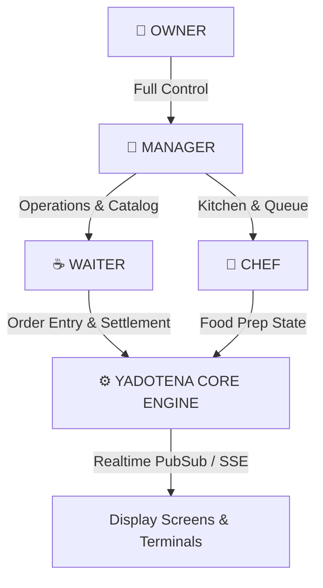

# Yadotena POS — Staff Roles, Features & Operational Workflows

This document provides a comprehensive breakdown of the role-based features, permissions, user interfaces, and end-to-end operational workflows within the **Yadotena Point-Of-Sale (POS) System**.

---

## 1. System Roles & Capabilities Overview



---

## 2. Role-by-Role Feature & Functionality Matrix

### 👑 1. OWNER
The **Owner** role represents the highest level of administrative authority within the enterprise.
* **Core Responsibilities**: Financial oversight, system configuration, staff management, audit compliance, business performance analytics.
* **Exclusive Features & Capabilities**:
  * **User & Access Control**: Create, update, suspend, or terminate user accounts across all roles (`OWNER`, `MANAGER`, `WAITER`, `CHEF`). Assign security credentials and PINs.
  * **Financial Reporting & Analytics**: Access high-level sales summaries, daily revenue metrics, tax breakdowns, top-selling items, and category profitability.
  * **Expense Ledger Control**: View and audit all recorded operational business expenses (wages, utility bills, inventory restocking).
  * **Audit Trail Inspection**: Review immutable system activity logs, capturing sensitive operational events (voided items, cancelled orders, manual price overrides, login attempts).
  * **Global Settings**: Configure business details (tax rates, service charge %, restaurant name, currency format, operating hours).
  * **Payment Method Scoping**: Add, edit, or disable bank payment channels (Telebirr, CBE Birr, Bank of Abyssinia, Cash).

---

### 👔 2. MANAGER
The **Manager** role oversees daily restaurant operations, inventory availability, floor service efficiency, and cashier reconciliation.
* **Core Responsibilities**: Catalog management, table layout control, expense recording, payment verification, staff assistance.
* **Features & Capabilities**:
  * **Menu & Storefront Catalog Management**: Create, edit, or delete menu items, descriptions, prices, images, and category assignments.
  * **Addon & Scoping Management**: Configure dish modification options (e.g. Oat Milk, Extra Shot, Spicy Level) and attach them globally or to specific items.
  * **Table & Floor Plan Management**: Configure dining room layout, table numbers, seating capacity, and QR tokens.
  * **Digital Payment Verification**: Review and verify digital bank transfer reference IDs or uploaded receipt images for customer settlements.
  * **Expense Recording**: Record operational costs directly into the ledger.
  * **Item Out-Of-Stock Toggles**: Instantly mark dishes or ingredients as unavailable across all POS terminals and customer mobile menus.

---

### ☕ 3. WAITER
The **Waiter** role powers front-of-house order taking, customer table management, food delivery, and payment collection.
* **Core Responsibilities**: Order composition, table session management, serving food, settling bills.
* **Features & Capabilities**:
  * **Table-First Workflow**: Select an active table before initiating dine-in order entry to prevent unassigned orders.
  * **Dual Catalog Order Entry**:
    * *Prepared Kitchen Menu*: Pick kitchen-cooked dishes and customize addons/modifiers.
    * *Retail Shop Store*: Pick pre-packaged counter products (coffee beans, butter jars, honey) bypassing kitchen queue.
  * **Append Rounds**: Seamlessly append additional food/drink items to an existing active table session.
  * **Kitchen Note Presets**: 1-tap quick kitchen instructions ("No Spicy", "Serve Warm", "Extra Hot", "Separate Plate").
  * **Service Request Resolution**: Receive instant alerts for customer table calls ("Call Waiter", "Request Bill") and resolve them.
  * **Dynamic Payment Settlement**: Process payments using database-backed payment methods (Cash calculator with preset chips & change return, or Digital Bank transfer with reference ID entry).

---

### 🍳 4. CHEF
The **Chef** role operates the Kitchen Display System (KDS), managing order preparation timelines and fulfillment updates.
* **Core Responsibilities**: Food prep execution, order state progression, kitchen timing.
* **Features & Capabilities**:
  * **Live KDS Queue**: Real-time order cards sorted by arrival time and preparation urgency.
  * **Visual State Machine Controls**:
    * Tap **Start Preparing** (`PENDING` → `PREPARING`).
    * Tap **Mark Ready** (`PREPARING` → `READY` — triggers audio alert and waiter ping).
  * **Item Breakdown & Customization Focus**: Clear highlight of special instructions and selected addons per item.
  * **Batch Preparation View**: Aggregated item counts across all active pending tickets (e.g. "Total Cappuccinos to make: 5").

---

## 3. End-to-End Operational Workflows

### Workflow A: Standard Dine-In Order Lifecycle

```text
[ WAITER ]                  [ CHEF / KDS ]               [ WAITER / CASHIER ]
   │                              │                              │
 1. Select Table #3               │                              │
   │                              │                              │
 2. Add Items & Addons            │                              │
   │                              │                              │
 3. Tap "Send to Kitchen"         │                              │
   └─── Status: PENDING ─────────>│                              │
                                  │                              │
                                4. Tap "Start Prep"              │
                                  └── Status: PREPARING          │
                                  │                              │
                                5. Tap "Mark Ready" 🛎️           │
                                  └── Status: READY ────────────>│
                                                                 │
                                                               6. Deliver Food
                                                                 └── Status: SERVED
                                                                 │
                                                               7. Customer Pays
                                                                 └── Status: PAID → COMPLETED
```

---

### Workflow B: Over-the-Counter Retail Sale (Instant Bypass)

```text
[ WAITER / CASHIER ]
   │
 1. Tap "+ QUICK SHOP SALE"
   │
 2. Select Packaged Items (e.g. 2x Tomoca Coffee Beans 500g)
   │
 3. System detects non-prepared retail items
   └── Kitchen Queue: BYPASSED (Status: COMPLETED)
   │
 4. Open Settlement Modal → Input Payment (Cash / Telebirr)
   │
 5. Complete Sale & Issue Digital Receipt
```

---

### Workflow C: Append Additional Round to Active Table

```text
[ WAITER ]
   │
 1. Select Table #3 (Currently OCCUPIED with Order #ORD-8921)
   │
 2. System displays alert: "Active Order Found. Added items will append."
   │
 3. Pick 2x Desserts + 1x Espresso
   │
 4. Tap "Append to Table Order"
   │
 5. Server appends round to #ORD-8921, recalculates subtotal, and routes new items to KDS
```

---

### Workflow D: Payment Settlement & Concurrency Protection

```text
[ WAITER / CASHIER ]                                [ POSTGRESQL ENGINE ]
   │                                                         │
 1. Tap "Settle Payment" for Order #ORD-123                  │
   │                                                         │
 2. Select Payment Method (e.g. CBE Birr)                    │
   │                                                         │
 3. Enter Txn Ref "CBE-88992211"                             │
   │                                                         │
 4. Send POST /api/v1/payments ────────────────────────────>│
                                                             │
                                                           5. BEGIN TRANSACTION
                                                           6. SELECT order FOR UPDATE
                                                           7. Verify Status != PAID
                                                           8. INSERT payment record
                                                           9. UPDATE order payment_status = PAID
                                                           10. COMMIT TRANSACTION
   │                                                         │
 11. Payment Confirmed & Order Settled <──────────────────────┘
```

---

*Yadotena POS Roles & Operations Guide v1.0*
